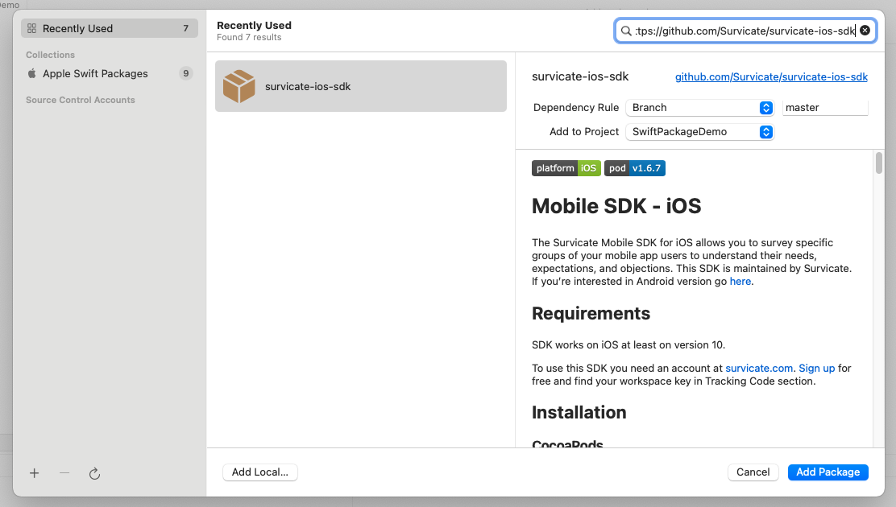
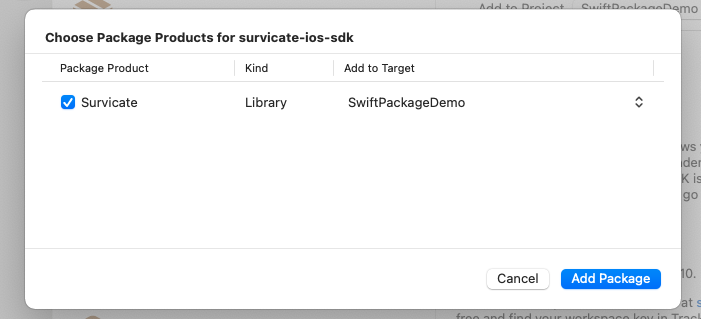

# **Mobile SDK - iOS**

The Survicate Mobile SDK allows you to collect feedback from your mobile app users. Installed in your app, the SDK will enable you to trigger targeted surveys to better understand your users and collect their opinions about your products. 

The SDK is maintained and supported by Survicate - The Customer Experience & Survey Software.

The detailed documentation is available [here](https://developers.survicate.com/mobile-sdk/ios/). 

## **Requirements**

- Minimum Xcode version: 14.0
- Minimum iOS version: 14.0

To use this SDK, you need an account at [survicate.com](https://survicate.com).
[Sign up](https://panel.survicate.com/#/signup) for free and locate your workspace key in the Settings.

## **Installation**

The SDK can be installed in the iOS mobile app using one of the three methods described below.

### **Swift Package Manager**

To install Survicate using Swift Package Manager: 

- Open Xcode and select New Project in the File > New > Project… menu to create a new project for your application.
- Choose the App template for your project.
- When prompted, choose your app name (for example, SurvicateSPDemo) and use the default options, next select the location to save the project and finally click on the Create button to finish project creation.
- Once the project is created, open your application in Xcode and select your project’s Package Dependencies tab
- Copy the Survicate SDK Swift package repository URL `https://github.com/Survicate/survicate-ios-sdk` into the search field
- Under Dependency Rule, select version according to your preferences

- After the package download completes, select Add Package

Survicate SDK should now be listed under Swift Package Dependencies in the Xcode Project navigator.

The detailed description on how to use Survicate Mobile SDK is available here: [Mobile SDK Setup](https://developers.survicate.com/mobile-sdk/setup/).

### **Other installation methods**

The Survicate Mobile SDK can also be installed:

- [Using CocoaPods](https://developers.survicate.com/mobile-sdk/installation/#cocoapods)
- [Manually](https://developers.survicate.com/mobile-sdk/installation/#manual-installation-1)

## Issues

Got an Issue?

To make things more streamlined, we’ve transitioned our issue reporting to our customer support platform. If you encounter any bugs or have feedback, please reach out to our customer support team. Your insights are invaluable to us, and we’re here to help ensure your experience is top-notch!

Contact us via Intercom in the application, or drop us an email at: [support@survicate.com]

Thank you for your support and understanding!
